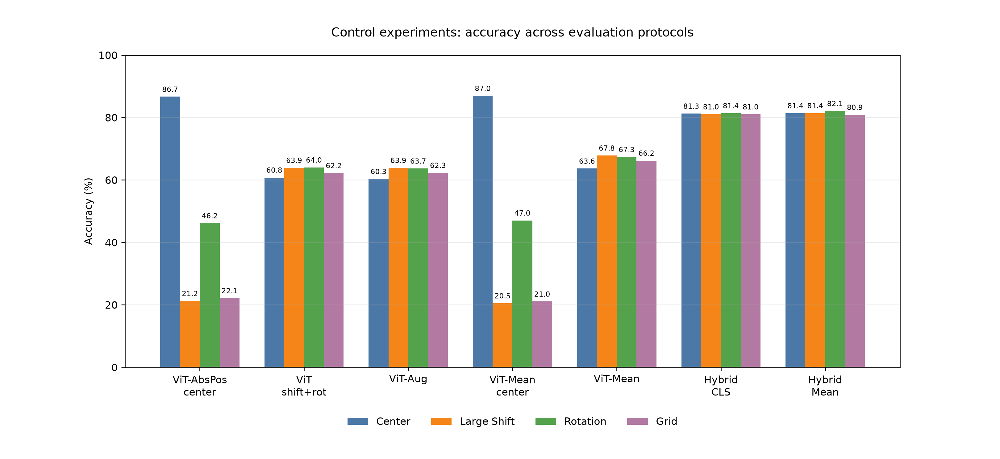
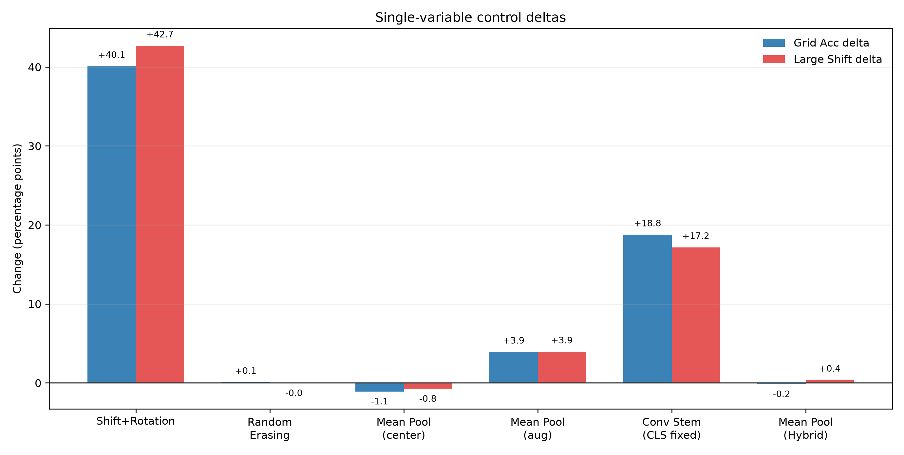
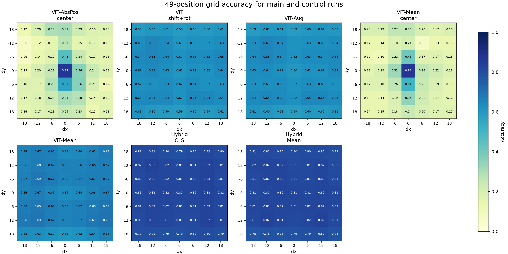
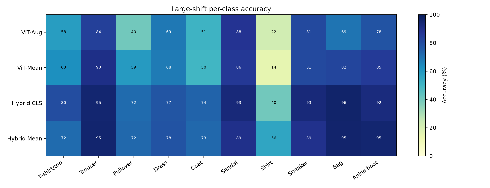

# E3-E6 补充控制实验数据

## 目的

原六组实验采用从 E3 到 E6 逐步叠加的设计，能够展示改进路径，但不能完全避免“没有保持单变量”的质疑。为补足这一点，本次增加三组控制实验，用来拆分训练增强、Random Erasing、Mean Pooling 和 Conv Stem 的贡献。

## 补充实验设置

| Run | Model | Train mode | Random Erasing | Pooling | Conv Stem | 对照目的 |
| --- | --- | --- | --- | --- | --- | --- |
| `vit_shiftrot_noerase_cpu` | ViT | shift_rotation | 0.00 | CLS | No | 拆分 shift_rotation 与 Random Erasing |
| `vit_meanpool_center_cpu` | ViT | center | 0.00 | Mean | No | 检查 Mean Pooling 在中心训练下是否独立改善鲁棒性 |
| `hybrid_vit_cls_cpu` | HybridConv-ViT | shift_rotation | 0.25 | CLS | Yes | 固定 CLS pooling 后评估 Conv Stem |

所有补充实验沿用原项目的随机种子、数据划分、训练预算、优化器和评估协议。三组实验均完成 49 点 grid evaluation。

## 主要结果

| Run | Center Acc | Large Shift Acc | Rotation Acc | Shift+Rotation Acc | Grid Acc | Robust Drop | Grid rows |
| --- | ---: | ---: | ---: | ---: | ---: | ---: | ---: |
| `vit_abspos_center_cpu` | 86.67% | 21.24% | 46.16% | 18.55% | 22.14% | 65.43% | 49 |
| `vit_shiftrot_noerase_cpu` | 60.77% | 63.92% | 64.01% | 64.33% | 62.21% | -3.15% | 49 |
| `vit_aug_cpu` | 60.32% | 63.89% | 63.66% | 63.64% | 62.29% | -3.57% | 49 |
| `vit_meanpool_center_cpu` | 86.95% | 20.49% | 47.02% | 17.67% | 21.05% | 66.46% | 49 |
| `vit_meanpool_cpu` | 63.64% | 67.83% | 67.35% | 67.93% | 66.20% | -4.19% | 49 |
| `hybrid_vit_cls_cpu` | 81.27% | 81.05% | 81.41% | 80.80% | 81.05% | 0.22% | 49 |
| `hybrid_vit_cpu` | 81.40% | 81.41% | 82.11% | 81.02% | 80.89% | -0.01% | 49 |

## 单变量对照结论

| 对照 | Center | Large Shift | Rotation | Shift+Rotation | Grid | Robust Drop |
| --- | ---: | ---: | ---: | ---: | ---: | ---: |
| `vit_shiftrot_noerase_cpu` - `vit_abspos_center_cpu` | -25.90 pp | +42.68 pp | +17.85 pp | +45.78 pp | +40.08 pp | -68.58 pp |
| `vit_aug_cpu` - `vit_shiftrot_noerase_cpu` | -0.45 pp | -0.03 pp | -0.35 pp | -0.69 pp | +0.08 pp | -0.42 pp |
| `vit_meanpool_center_cpu` - `vit_abspos_center_cpu` | +0.28 pp | -0.75 pp | +0.86 pp | -0.88 pp | -1.09 pp | +1.03 pp |
| `vit_meanpool_cpu` - `vit_aug_cpu` | +3.32 pp | +3.94 pp | +3.69 pp | +4.29 pp | +3.91 pp | -0.62 pp |
| `hybrid_vit_cls_cpu` - `vit_aug_cpu` | +20.95 pp | +17.16 pp | +17.75 pp | +17.16 pp | +18.76 pp | +3.79 pp |
| `hybrid_vit_cpu` - `hybrid_vit_cls_cpu` | +0.13 pp | +0.36 pp | +0.70 pp | +0.22 pp | -0.16 pp | -0.23 pp |

## 结果可视化

### 1. 训练分布扩展是 ViT 鲁棒性改善的主因

在不使用 Random Erasing 的情况下，仅将训练分布从 center 改为 shift_rotation，就使 ViT 的 Grid Acc 从 22.14% 提升到 62.21%，Large Shift Acc 从 21.24% 提升到 63.92%。这说明原 E3 到 E4 的主要改善来自训练阶段覆盖位置和角度变化，而不是模型结构变化。

### 2. Random Erasing 在当前设置下贡献很小

`vit_aug_cpu` 相比 `vit_shiftrot_noerase_cpu` 的 Grid Acc 只提升 0.08 pp，Large Shift Acc 反而微降 0.03 pp，Rotation Acc 微降 0.35 pp。可以认为，在本实验预算和模型规模下，Random Erasing 不是主要贡献来源。报告中应把 E4 的收益主要归因于 shift_rotation 训练分布扩展，而不是 Random Erasing。

### 3. Mean Pooling 单独不能解决中心训练偏置

`vit_meanpool_center_cpu` 与 `vit_abspos_center_cpu` 的 Center Acc 基本相同，但 Grid Acc 从 22.14% 降到 21.05%，Large Shift Acc 从 21.24% 降到 20.49%。这说明 Mean Pooling 本身不能在中心训练条件下自动带来位置鲁棒性。

在增强训练条件下，Mean Pooling 有稳定但中等幅度的增益：`vit_meanpool_cpu` 相比 `vit_aug_cpu` 的 Grid Acc 提升 3.91 pp，Large Shift Acc 提升 3.94 pp。因此更准确的表述是：Mean Pooling 在训练分布已经覆盖位置变化时，可以进一步改善聚合稳定性，但它不是消除中心偏置的根本因素。

### 4. Conv Stem 是 Hybrid 改进中的主要结构因素

固定 CLS pooling 后，`hybrid_vit_cls_cpu` 相比 `vit_aug_cpu` 的 Grid Acc 提升 18.76 pp，Large Shift Acc 提升 17.16 pp，Rotation Acc 提升 17.75 pp。这是补充实验中最强的结构性增益，说明 Conv Stem 在当前小型灰度图像任务中确实提供了重要的局部归纳偏置。

进一步比较 `hybrid_vit_cpu` 与 `hybrid_vit_cls_cpu`，Mean Pooling 对 Hybrid 的整体影响很小：Grid Acc 微降 0.16 pp，Large Shift Acc 提升 0.36 pp，Rotation Acc 提升 0.70 pp。由此可见，原 E6 的优势主要应归因于 Conv Stem，而不是 Mean Pooling。

## 逐类表现补充

在 Large Shift 条件下，`hybrid_vit_cls_cpu` 相比 `vit_aug_cpu` 对所有类别都有提升，尤其是 Pullover、Bag、Coat、T-shirt/top 和 Shirt：

| Class | ViT-Aug | ViT-MeanPool | Hybrid-CLS | Hybrid-Mean | Hybrid-CLS - ViT-Aug |
| --- | ---: | ---: | ---: | ---: | ---: |
| T-shirt/top | 58.30% | 62.60% | 79.70% | 71.80% | +21.40 pp |
| Trouser | 83.60% | 90.00% | 94.70% | 95.00% | +11.10 pp |
| Pullover | 40.20% | 59.20% | 71.60% | 72.30% | +31.40 pp |
| Dress | 68.50% | 67.70% | 77.50% | 78.10% | +9.00 pp |
| Coat | 50.80% | 49.70% | 73.50% | 72.60% | +22.70 pp |
| Sandal | 87.60% | 86.20% | 92.80% | 89.20% | +5.20 pp |
| Shirt | 21.70% | 14.50% | 40.00% | 55.80% | +18.30 pp |
| Sneaker | 80.90% | 80.90% | 92.80% | 88.90% | +11.90 pp |
| Bag | 69.40% | 82.30% | 95.80% | 95.50% | +26.40 pp |
| Ankle boot | 77.90% | 85.20% | 92.10% | 94.90% | +14.20 pp |

Mean Pooling 的类别影响更不均衡：它显著改善 Pullover、Bag 和 Ankle boot，但降低 Shirt、Sandal、Coat 和 Dress。这进一步支持“Mean Pooling 是中等幅度、条件依赖的改进”，而不是主因。

## 对正式报告表述的建议

原 E3-E6 不应表述为严格单变量消融，而应表述为主实验的渐进式设计。补充控制实验可以作为对单变量问题的回应：

1. E4 的主要收益来自 shift_rotation 训练分布扩展；Random Erasing 在当前结果中贡献很小。
2. Mean Pooling 不能单独解决中心训练偏置，但在增强训练条件下提供约 3.9 pp 的 Grid Acc 增益。
3. Conv Stem 在固定增强与 CLS pooling 后仍带来约 18.8 pp 的 Grid Acc 增益，是 Hybrid 表现提升的主要结构来源。
4. 因此，最终结论可以从“E6 组合表现最好”具体为：“训练分布扩展是基础，Conv Stem 是最主要的补充，Mean Pooling 提供较小的稳定性。”

## 说明

这些补充实验仍使用单一随机种子，更严格的版本可以对关键对照重复 3 个 seed，但从当前幅度看，shift_rotation 与 Conv Stem 的收益远大于随机波动可能解释的范围；Random Erasing 和 Hybrid 内部 pooling 的差异则应表述为“当前设置下影响很小”。
