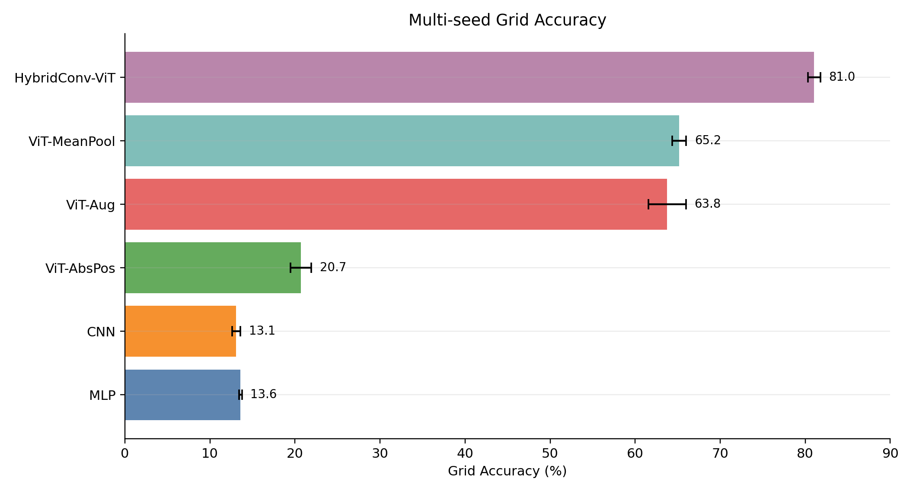
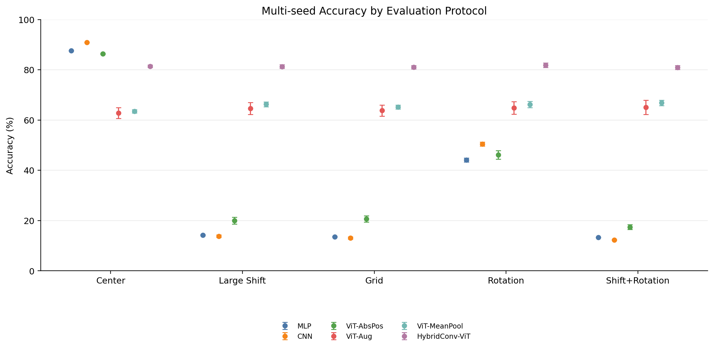
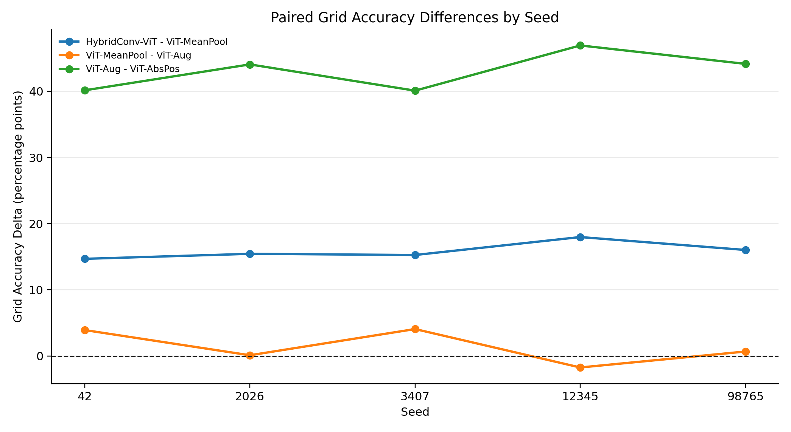
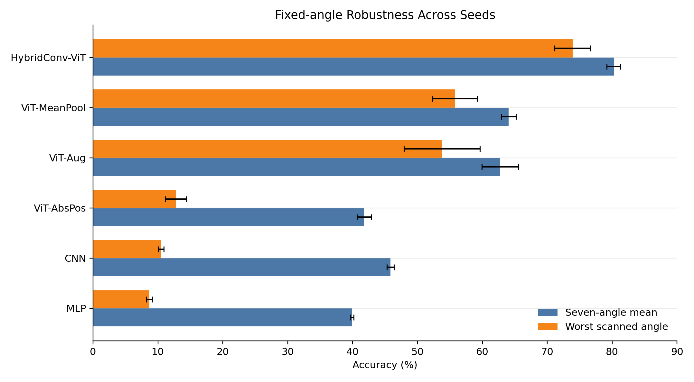

# 多随机种子结果汇总与报告补充建议

日期：2026-07-14

## 1. 实验完整性检查

本次多随机种子实验使用 5 个固定随机种子：

```text
42, 2026, 3407, 12345, 98765
```

六组正式模型均完成 5 次独立运行，共 30 个 run：

检查结果：

| 检查项 | 结果 |
|---|---:|
| 多 seed run 数量 | 30 / 30 |
| 缺失 `evaluation.json` | 0 |
| 缺失 `checkpoints/best.pt` | 0 |
| 缺失 49 点 grid CSV | 0 |
| 缺失 7 角度 angle CSV | 0 |
| grid CSV 行数异常 | 0 |
| angle CSV 行数异常 | 0 |

因此，本轮结果可以用于报告中的统计稳健性补充。

## 2. 主指标汇总

下表单位均为百分比，只显示 5 个 seed 的均值。Grid Accuracy 使用每个 run 的 `tables/grid_accuracy.csv` 重新计算 49 点宏平均，而不是只读取旧的全局汇总表。

| Model | Center | Large Shift | Grid | Rotation | Shift+Rotation | Robust Drop |
|---|---:|---:|---:|---:|---:|---:|
| MLP | 87.63 | 14.22 | 13.58 | 44.14 | 13.31 | 73.41 |
| CNN | 90.93 | 13.80 | 13.09 | 50.47 | 12.33 | 77.13 |
| ViT-AbsPos | 86.38 | 20.03 | 20.68 | 46.18 | 17.40 | 66.35 |
| ViT-Aug | 62.81 | 64.60 | 63.77 | 64.86 | 65.04 | -1.80 |
| ViT-MeanPool | 63.51 | 66.29 | 65.17 | 66.20 | 66.83 | -2.78 |
| HybridConv-ViT | 81.42 | 81.33 | 81.05 | 81.86 | 80.90 | 0.09 |

## 3. 固定角度扫描补充

固定角度结果来自每个 run 的 7 个角度扫描。`Fixed-angle Mean` 是七个角度准确率的宏平均；`Fixed-angle Worst` 是七个角度中的最差角度准确率。单位为百分比，表中只显示 5 个 seed 的均值。

| Model | Fixed-angle Mean | Fixed-angle Worst |
|---|---:|---:|
| MLP | 39.93 | 8.69 |
| CNN | 45.84 | 10.47 |
| ViT-AbsPos | 41.75 | 12.74 |
| ViT-Aug | 62.75 | 53.76 |
| ViT-MeanPool | 64.02 | 55.76 |
| HybridConv-ViT | 80.24 | 73.89 |

这个结果支持当前报告中的角度鲁棒性判断：中心训练基线在极端角度下明显失效；增强模型显著改善旋转鲁棒性；HybridConv-ViT 不仅平均最高，而且最差角度也保持在约 74%。

## 4. 配对差值与结论稳定性

为了避免只比较跨 seed 均值，下面按同一 seed 做配对比较。单位为百分点。

| Comparison | Positive Seeds | Mean Diff | Std | Interpretation |
|---|---:|---:|---:|---|
| HybridConv-ViT - ViT-MeanPool, Grid | 5 / 5 | 15.87 | 1.27 | 稳定成立 |
| ViT-MeanPool - ViT-Aug, Grid | 4 / 5 | 1.40 | 2.53 | 只能说有轻微平均提升，不能强结论 |
| ViT-Aug - ViT-AbsPos, Grid | 5 / 5 | 43.09 | 2.93 | 稳定成立 |

逐 seed 的 Grid 排名也支持这一点：HybridConv-ViT 在 5 个 seed 下均为第一。

| Seed | Grid 第一名 | Grid 第一名准确率 | 第二名 |
|---:|---|---:|---|
| 42 | HybridConv-ViT | 80.89 | ViT-MeanPool |
| 2026 | HybridConv-ViT | 80.96 | ViT-MeanPool |
| 3407 | HybridConv-ViT | 79.99 | ViT-MeanPool |
| 12345 | HybridConv-ViT | 81.99 | ViT-Aug |
| 98765 | HybridConv-ViT | 81.39 | ViT-MeanPool |

## 5. 可视化图像

本轮已生成四张多 seed 补充图，均已复制到 `report/figures/`，可直接插入报告。

### 5.1 Grid Accuracy 误差棒



用途：替换或补充原来的单 seed `grid_accuracy_comparison.png`。这张图最适合说明 HybridConv-ViT 的 Grid Accuracy 不只是单次运行最高，而是在五个 seed 下均值高且波动小。

### 5.2 多协议准确率误差棒



用途：放在主结果小节，用于展示 Center、Large Shift、Grid、Rotation 和 Shift+Rotation 五类协议下的整体格局。它能直观看出中心训练模型在 Center 上高，但在位置扰动协议下断崖式下降。

### 5.3 配对 Grid 差值



用途：放在“从增强到 Hybrid 的逐步变化”小节。零线以上表示左侧模型优于右侧模型。这张图能支持两个强结论：HybridConv-ViT 稳定优于 ViT-MeanPool，ViT-Aug 稳定优于 ViT-AbsPos；同时也能说明 ViT-MeanPool 相比 ViT-Aug 的优势并不稳定。

### 5.4 固定角度平均与最差角度



用途：补充固定角度扫描结果。它同时展示七角度平均表现和最差角度表现，比只报告 Rotation Accuracy 更能说明极端角度下的鲁棒性。

## 6. 与单 seed 结果相比的结论变化

### 6.1 被强化的结论

1. **中心准确率不能代表位置鲁棒性。**

   CNN 的 Center Accuracy 最高，平均达到 `90.93%`，但 Grid Accuracy 平均只有 `13.09%`，Center 到 Grid 的平均差距为 `77.84` 个百分点。这个现象在 5 个 seed 下都稳定存在。

2. **训练分布覆盖是最主要的鲁棒性来源之一。**

   ViT-Aug 相比 ViT-AbsPos 的 Grid Accuracy 平均提升 `43.09` 个百分点，且 5 个 seed 全部为正。这说明 Shift+Rotation 训练分布不是偶然提升，而是稳定改善位置可变任务表现。

3. **HybridConv-ViT 是当前最稳健的方案。**

   HybridConv-ViT 在 Center、Large Shift、Grid、Rotation 和 Shift+Rotation 上均保持约 `80%--82%`，Grid Accuracy 平均为 `81.05%`，并在 5 个 seed 下全部取得 Grid 第一。

### 6.2 需要弱化的结论

1. **Mean Pooling 相比 CLS 的优势不应写得太强。**

   ViT-MeanPool 的 Grid Accuracy 平均为 `65.17%`，ViT-Aug 平均为 `63.77%`，平均高 `1.40` 个百分点。但同 seed 配对只有 `4 / 5` 为正，且差值标准差 `2.53` 大于均值。因此报告中应写成：

   > Mean Pooling 在平均 Grid Accuracy 上略高于 CLS，但差距接近随机种子波动范围，因此只能作为趋势性证据，不能单独证明聚合方式带来稳定收益。

2. **E4 到 E5 的单 seed 约 4 个百分点提升不再稳固。**

   原报告中单 seed 写法容易给人一种 E5 明显优于 E4 的感觉。多 seed 后，E5 仍略高，但证据强度下降。建议将原文中“支持 Mean Pooling 改善稳定性”的表述改为“提示 Mean Pooling 可能改善稳定性，但还需要更多实验或更严格消融确认”。

## 7. 对现报告的具体补充建议

### 7.1 `04_training.tex`

建议在“训练设置”后新增一小段，说明单 seed 与多 seed 的关系：

```latex
为评估结论对随机初始化和数据划分的敏感性，本文在六组正式模型之外增加多随机种子复现实验。五个种子分别为 42、2026、3407、12345 和 98765。每个种子同时控制训练/验证划分、模型初始化、DataLoader shuffle、位置扰动采样和数据增强随机性。除随机种子和 run name 外，其余超参数保持不变。
```

### 7.2 `05_experiments.tex`

建议在“三层对照逻辑”后新增“多随机种子稳健性验证”小节：

```latex
\subsection{多随机种子稳健性验证}

单次随机种子实验可以展示完整实验链路，但模型初始化、训练/验证划分和增强采样都可能影响最终数值。为避免将偶然结果解释为稳定结论，本文对六组正式模型分别使用五个固定随机种子重复训练，并在同一 seed 下进行配对比较。主表报告均值和标准差；模型间差异则同时检查五个 seed 中差值符号是否一致。
```

### 7.3 `06_results.tex`

建议将开头第一段从“六个正式 run”改为“六组模型、五个 seed 的正式 run”：

```latex
本节使用六组模型在五个随机种子下的正式 run，不包含 smoke test。主表报告五个 seed 的均值，标准差通过误差棒图和补充表呈现。对于模型间比较，除均值差异外，还检查同一 seed 下的配对差值，以避免把单次随机初始化造成的波动误认为稳定改进。
```

### 7.5 “从增强到 Hybrid 的逐步变化”小节

建议调整三处结论强度：

1. **E3 到 E4：保留强结论。**

   可写：

   > ViT-Aug 相比 ViT-AbsPos 的 Grid Accuracy 平均提升 43.09 个百分点，且五个 seed 中配对差值均为正，说明扩大训练分布是本任务中最稳定的改进来源之一。

2. **E4 到 E5：弱化。**

   可写：

   > ViT-MeanPool 的 Grid Accuracy 平均比 ViT-Aug 高 1.40 个百分点，但该差异在五个 seed 中并不完全一致，因此只能说明 Mean Pooling 呈现轻微正向趋势，不能单独作为强因果证据。

3. **E5 到 E6：强化。**

   可写：

   > HybridConv-ViT 相比 ViT-MeanPool 的 Grid Accuracy 平均提升 15.87 个百分点，且五个 seed 中均为正。该结果说明卷积 stem 与增强训练、Mean Pooling 的组合带来了稳定收益。

### 7.6 “证据边界”段落

原报告中已经有证据边界意识，但现在可以更新为：

```latex
多随机种子结果降低了单次初始化偶然性的影响，但当前实验仍不是完整全因子消融。E4 同时引入平移、旋转和擦除，E6 又是在增强与 Mean Pooling 基础上加入卷积 stem。因此，本文可以稳定支持“组合方案有效”和“训练分布覆盖很关键”，但仍不能把每个因素的独立贡献完全分解。
```

## 8. 建议加入报告的总结性表述

可以在结果章节结尾加入：

```text
多随机种子实验整体强化了本文的主结论：中心位置准确率最高的模型并不具备位置鲁棒性；覆盖目标扰动的训练分布可以显著提升 Grid Accuracy；HybridConv-ViT 在五个随机种子下均取得最高的 Grid Accuracy，并在平移、旋转和复合扰动中保持约 81% 的准确率。与此同时，Mean Pooling 相比 CLS 的单独收益在多 seed 下不够稳定，因此本文将其解释为趋势性改进，而非决定性因素。
```